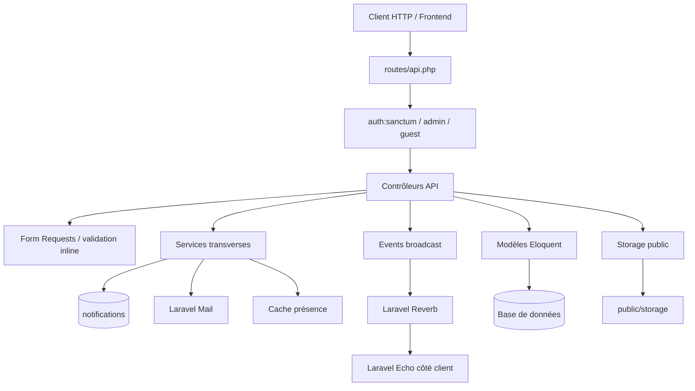
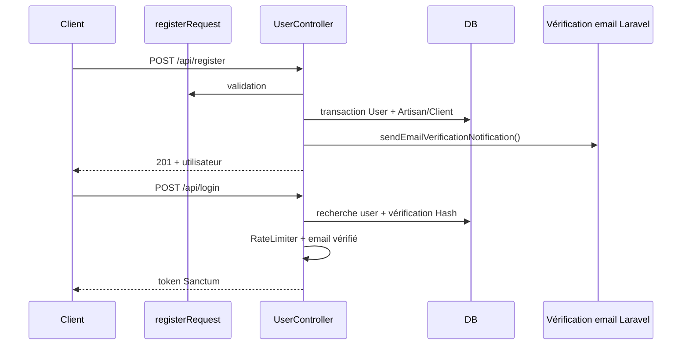
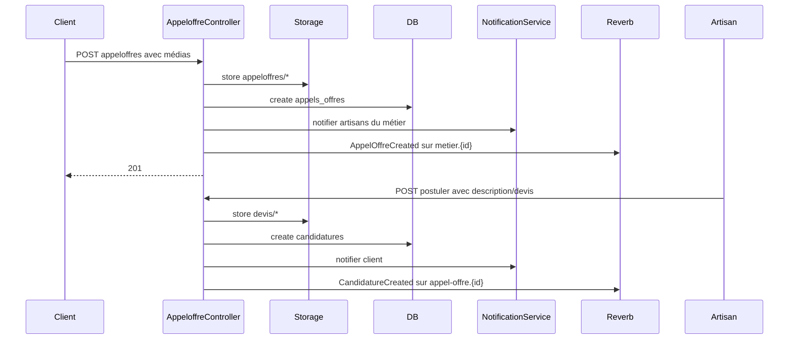
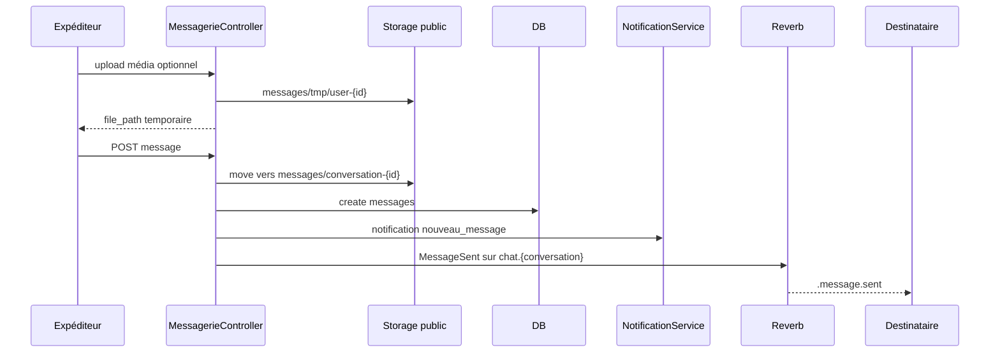
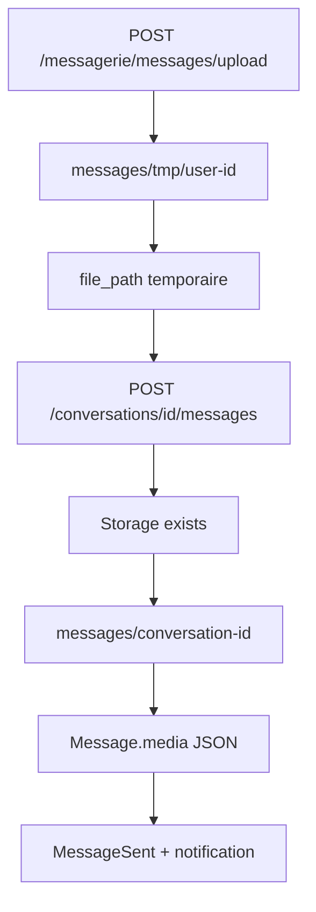

# FYA Backend - Documentation technique

FYA est une API Laravel pour mettre en relation des clients et des artisans. Le projet couvre l'inscription, l'authentification Sanctum, les profils artisans/clients, les publications, les appels d'offres, les candidatures, la messagerie temps réel, les services, les avis, les plaintes, les notifications et un espace d'administration.

Cette documentation est basée uniquement sur le code présent dans ce dépôt.

## Table des matières

1. [Stack technique](#stack-technique)
2. [Architecture globale](#architecture-globale)
3. [Structure du projet](#structure-du-projet)
4. [Modèle de données](#modèle-de-données)
5. [API et flux fonctionnels](#api-et-flux-fonctionnels)
6. [Architecture des notifications](#architecture-des-notifications)
7. [Architecture des médias](#architecture-des-médias)
8. [Documentation du code](#documentation-du-code)
9. [Configuration et exploitation](#configuration-et-exploitation)
10. [Éléments absents ou non implémentés](#éléments-absents-ou-non-implémentés)

## Stack technique

| Élément | Implémentation constatée |
| --- | --- |
| Framework | Laravel 13.x |
| PHP | `^8.3` |
| Authentification API | Laravel Sanctum |
| Temps réel | Laravel Reverb, Laravel Echo, Pusher JS |
| Base de données | Configuration Laravel standard, migrations MySQL compatibles, SQLite présent en local |
| Files d'attente | Configuration `database`, tables `jobs`, `job_batches`, `failed_jobs`; aucun Job applicatif dans `app/` |
| Stockage fichiers | Disque `public` local vers `storage/app/public`, URL `/storage/...` |
| Emails | Laravel Mail, `UserNotificationMail`, mailer par défaut `log` si non configuré |
| Paiement externe | FedaPay pour la certification artisan |

## Architecture globale

FYA suit une architecture Laravel MVC orientée API.

- **Routes** : `routes/api.php` expose les endpoints publics, authentifiés et administrateur.
- **Contrôleurs** : `app/Http/Controllers/Api` porte la logique applicative principale. Il n'y a pas de couche Repository.
- **Form Requests** : `app/Http/Requests` centralise une partie des validations.
- **Modèles Eloquent** : `app/Models` représente les tables et relations.
- **Services** : `NotificationService` et `UserPresenceService` portent les responsabilités transverses de notification et présence.
- **Events/Broadcasting** : `app/Events` diffuse les messages, appels d'offres, candidatures, likes et notifications temps réel.
- **Middleware** : `AdminMiddleware` protège le back-office.
- **Policies** : aucune policy Laravel dédiée. Une Gate `creerposte` est définie dans `AppServiceProvider`.
- **Queues** : la configuration queue existe, mais les notifications/emails utilisent `DB::afterCommit` et `Mail::send` directement; aucun Job applicatif n'est présent.



## Structure du projet

| Dossier/Fichier | Rôle |
| --- | --- |
| `app/Http/Controllers/Api` | Contrôleurs REST/JSON de l'API et du back-office. |
| `app/Http/Requests` | Validations de requêtes et réponses JSON d'erreur de validation. |
| `app/Models` | Modèles Eloquent et relations. |
| `app/Services` | Services applicatifs réutilisables: notifications et présence. |
| `app/Events` | Événements broadcast immédiats via `ShouldBroadcastNow`. |
| `app/Mail` | Email applicatif `UserNotificationMail`. |
| `app/Providers/AppServiceProvider.php` | Déclaration de la Gate `creerposte`. |
| `app/Http/Middleware/AdminMiddleware.php` | Autorisation des routes admin par `statut === admin`. |
| `routes/api.php` | Routes API actives. |
| `routes/channels.php` | Autorisation des canaux privés Reverb/Echo. |
| `config/filesystems.php` | Disques de stockage local/public/S3 et lien `public/storage`. |
| `config/broadcasting.php` | Connexions Reverb, Pusher, Ably, log, null. |
| `config/queue.php` | Queue database configurée, mais non utilisée par des jobs applicatifs. |
| `config/mail.php` | Mailers Laravel. |
| `config/services.php` | Services externes, dont FedaPay. |
| `database/migrations` | Schéma relationnel et migrations d'évolution. |
| `resources/js/echo.js` | Initialisation Laravel Echo/Reverb côté client. |
| `resources/js/realtime.js` | Helpers frontend pour présence et abonnements aux channels. |
| `resources/views/emails/user-notification.blade.php` | Vue email des notifications. |
| `storage/app/public` | Racine réelle des fichiers publics uploadés. |
| `public/storage` | Lien symbolique attendu vers `storage/app/public`. |

Notes:

- `database/migrations/api.php` contient d'anciennes définitions de routes. Ce fichier n'est pas une migration de schéma et n'est pas chargé comme `routes/api.php`.
- La route active `/api/metiers` pointe vers `MetierController@listesmetiers`, mais la méthode réellement définie s'appelle `listemetiers`. En l'état, cette route risque de provoquer une erreur à l'exécution tant que le nom n'est pas aligné.

## Modèle de données

| Table | Modèle | Responsabilité |
| --- | --- | --- |
| `users` | `User` | Compte utilisateur, rôle `clients`, `artisans` ou `admin`, statut, contact, photo. |
| `artisans` | `ArtisanModel` | Profil artisan, métier, certification, documents et informations professionnelles. |
| `clients` | `ClientModel` | Profil client lié à un utilisateur. |
| `metiers` | `MetierModel` | Référentiel des métiers. |
| `posts` | `PostModel` | Publications artisans avec médias. |
| `likes` | `LikeModel` | Likes des posts. |
| `commentaires` | `CommentaireModel` | Commentaires de posts. |
| `appels_offres` | `AppelOffreModel` | Demandes clients ciblées par métier. |
| `candidatures` | `CandidatureModel` | Réponses artisans aux appels d'offres. |
| `conversations` | `ConversationModel` | Conversations privées entre deux utilisateurs. |
| `messages` | `MessageModel` | Messages texte, média, mixed ou note vocale. |
| `services` | `ServiceModel` | Prestations proposées, validées, annulées ou terminées. |
| `avis` | `AvisModel` | Avis entre utilisateurs, note 1 à 5, unicité auteur/cible. |
| `plaintes` | `Plainte` | Signalements utilisateurs et traitement admin. |
| `payments` | `PaymentModel` | Transactions FedaPay liées aux artisans. |
| `notifications` | `NotificationModel` | Notifications persistées FYA. |

## API et flux fonctionnels

### Routes principales

| Méthode | URI | Contrôleur | Auth | Rôle |
| --- | --- | --- | --- | --- |
| POST | `/api/register`, `/api/register/client`, `/api/register/artisan` | `UserController@register` | guest | Créer un utilisateur. |
| POST | `/api/login` | `UserController@authenticate` | guest | Connexion Sanctum. |
| GET | `/api/email/verify/{id}/{hash}` | `UserController@verifyEmail` | signed | Vérification email. |
| POST | `/api/email/verification-notification` | `UserController@resendVerificationEmail` | guest | Renvoyer le lien email. |
| GET | `/api/metiers` | `MetierController@listesmetiers` | guest | Liste des métiers; anomalie: la méthode définie est `listemetiers`. |
| GET | `/api/recherche-artisans` | `UserController@rechercheArtisan` | public | Recherche artisans. |
| GET | `/api/posts/feed` | `ArtisanController@feedPosts` | public/token optionnel | Feed posts. |
| POST | `/api/users/logout` | `UserController@logout` | Sanctum | Déconnexion. |
| POST | `/api/users/profile/photo` | `UserController@changementphoto` | Sanctum | Upload photo. |
| POST | `/api/posts/creerposts` | `ArtisanController@createposte` | Sanctum | Créer un post artisan. |
| POST | `/api/posts/{postid}/like` | `LikesController@like` | Sanctum | Toggle like. |
| POST | `/api/posts/commentaires` | `CommentairesController@postercommentaire` | Sanctum | Ajouter un commentaire. |
| POST | `/api/appeloffres/appeloffres` | `AppeloffreController@createappeloffre` | Sanctum | Créer un appel d'offres. |
| GET | `/api/appeloffres/feed-appels-offres` | `AppeloffreController@feedAppelsOffres` | Sanctum | Feed artisan par métier. |
| POST | `/api/appeloffres/appels-offres/{appelOffre}/postuler` | `AppeloffreController@postulerAppelOffre` | Sanctum | Candidater. |
| PATCH | `/api/appeloffres/candidatures/{candidature}/accepter` | `AppeloffreController@accepterCandidature` | Sanctum | Accepter une candidature. |
| POST | `/api/messagerie/conversations` | `MessagerieController@createConversation` | Sanctum | Créer/récupérer conversation. |
| POST | `/api/messagerie/messages/upload` | `MessagerieController@upload` | Sanctum | Upload média temporaire. |
| POST | `/api/messagerie/messages/voice/upload` | `MessagerieController@uploadVoiceNote` | Sanctum | Upload note vocale temporaire. |
| POST | `/api/messagerie/conversations/{conversation}/messages` | `MessagerieController@store` | Sanctum | Envoyer message. |
| GET | `/api/notifications` | `NotificationController@index` | Sanctum | Liste notifications. |
| POST | `/api/plaintes` | `PlainteController@plaintes` | Sanctum | Déposer plainte. |
| GET/PATCH/DELETE | `/api/admin/...` | Contrôleurs admin | Sanctum + admin | Back-office. |

### Flux majeurs

#### Inscription et connexion



#### Appel d'offres et candidature



#### Messagerie



## Architecture des notifications

### Types constatés

| Type | Déclencheur | Destinataire |
| --- | --- | --- |
| `nouvel_appel_offre` | Création d'un appel d'offres | Artisans dont `metier_id` correspond. |
| `nouvelle_candidature` | Artisan postule | Client propriétaire de l'appel d'offres. |
| `candidature_acceptee` | Client accepte une candidature | Artisan accepté. |
| `candidature_refusee` | Acceptation d'une autre candidature | Artisans non retenus. |
| `nouveau_message` | Envoi d'un message | Autre participant de la conversation. |
| `post_like` | Like ajouté à un post | Propriétaire du post, sauf auto-like. |

### Composants

| Composant | Rôle |
| --- | --- |
| `NotificationModel` | Persiste `user_id`, `type`, `data_json`, `read_at`. |
| `NotificationService::sendMany` | Crée les lignes puis planifie l'envoi après commit. |
| `UserPresenceService` | Détermine si un utilisateur est en ligne via cache TTL 90s. |
| `RealtimeNotificationSent` | Broadcast privé `.notification.created`. |
| `UserNotificationMail` | Email de fallback quand l'utilisateur est hors ligne. |
| `NotificationController` | Lecture et marquage côté utilisateur. |
| `AdminNotificationController` | Lecture et marquage côté admin connecté. |
| `resources/js/realtime.js` | Helpers frontend pour écouter les channels et maintenir la présence. |

### Flux email, base, push temps réel et pop-up

La notification est toujours persistée en base avant distribution. Ensuite:

- **Base de données** : toujours créée dans `notifications`.
- **Push temps réel / WebSocket** : si `UserPresenceService::isOnline(user_id)` retourne vrai, `RealtimeNotificationSent` est émis sur `App.Models.User.{id}`.
- **Email** : si l'utilisateur est hors ligne et possède un email, `UserNotificationMail` est envoyé immédiatement via `Mail::send`.
- **Pop-up** : aucun composant backend dédié. Le backend émet seulement l'événement temps réel; une pop-up éventuelle doit être gérée côté frontend via le callback `listenNotifications`.

```mermaid
flowchart TD
    Action[Action utilisateur] --> Controller[Contrôleur concerné]
    Controller --> NS[NotificationService::sendMany]
    NS --> DB[(notifications)]
    NS --> AfterCommit[DB::afterCommit]
    AfterCommit --> Fresh[Recharge notification + user]
    Fresh --> Presence{Utilisateur en ligne ?}
    Presence -- Oui --> Event[RealtimeNotificationSent]
    Event --> Channel[PrivateChannel App.Models.User.{id}]
    Channel --> Front[Echo listen .notification.created]
    Front --> Popup[Pop-up frontend si implémentée côté client]
    Presence -- Non --> Mail[UserNotificationMail]
    Mail --> Mailer[Mailer Laravel]
```

### Autres événements temps réel

| Event | Channel | Nom diffusé |
| --- | --- | --- |
| `MessageSent` | `private-chat.{conversation_id}` | `.message.sent` |
| `AppelOffreCreated` | `private-metier.{metier_id}` | `.appel-offre.created` |
| `CandidatureCreated` | `private-appel-offre.{appeloffer_id}` | `.candidature.created` |
| `CandidatureStatusUpdated` | `private-App.Models.User.{artisan_user_id}`, `private-appel-offre.{id}` | `.candidature.status.updated` |
| `PostLikeUpdated` | public `posts`, public `post.{postId}` | `.post.like.updated` |
| `RealtimeNotificationSent` | `private-App.Models.User.{user_id}` | `.notification.created` |

## Architecture des médias

### Stockage

Le projet utilise principalement `Storage::disk('public')` ou `UploadedFile::store(..., 'public')`.

| Usage | Dossier `storage/app/public` | Formats/limites |
| --- | --- | --- |
| Photo profil | `profile-photos/` | jpg, jpeg, png, webp, max ~5 Mo. |
| Posts artisans | `posts/` | jpg, jpeg, png, webp, mp4, mov, max 50 Mo, max 10 fichiers. |
| Appels d'offres | `appeloffres/` | jpg, jpeg, png, webp, mp4, mov, max 50 Mo, max 10 fichiers. |
| Devis candidature | `devis/` | PDF, max 5 Mo. |
| Certification diplôme | `certifications/diplomes/` | PDF, max 5 Mo. |
| Certification pièce identité | `certifications/pieces-identites/` | PDF, max 5 Mo. |
| Diplôme profil artisan | `diplomes/` | PDF, max 5 Mo. |
| Messagerie temporaire | `messages/tmp/user-{id}/` ou `messages/tmp/user-upload/` | Fichier max 20 Mo. |
| Messagerie finale | `messages/conversation-{id}/` | Média, pièce jointe ou note vocale. |

Le lien public attendu est:

```text
public/storage -> storage/app/public
```

Les URLs publiques sont générées par `Storage::url($path)` ou `asset('storage/'.$path)`. Aucun traitement d'image/vidéo (redimensionnement, transcodage, thumbnails, compression) n'est implémenté.

### Cycle de vie des médias

```mermaid
flowchart TD
    Client[Client multipart/form-data] --> Validation[FormRequest ou validation inline]
    Validation --> Store[store(..., public)]
    Store --> Path[Chemin relatif en base]
    Path --> URL[Storage::url ou asset/storage]
    URL --> Response[Réponse JSON]
    Response --> ClientDisplay[Affichage client]
```

### Cycle messagerie avec média temporaire



### Suppression et nettoyage

- `UserController@changementphoto` supprime l'ancienne photo si elle existe.
- `ArtisanController@createposte`, `AppeloffreController@postulerAppelOffre`, `MessagerieController@store` suppriment les fichiers stockés en cas d'erreur.
- `AdminOfferController@destroy` supprime l'appel d'offres mais ne supprime pas explicitement les médias liés.
- Aucun job périodique de nettoyage des fichiers temporaires de messagerie n'est présent.
- Aucun stockage S3 n'est utilisé dans le code applicatif, même si le disque `s3` existe dans la configuration Laravel.

## Documentation du code

### Contrôleurs API publics/authentifiés

#### `UserController`

| Méthode | Objectif | Paramètres | Retour | Exceptions/erreurs | Dépendances et appels |
| --- | --- | --- | --- | --- | --- |
| `register(registerRequest $request)` | Créer un utilisateur client/artisan et envoyer le mail de vérification. | Données validées: nom, email, password, statut, téléphone, métier si artisan. | JSON 201 avec user. | 500 si métier invalide ou exception transaction. | `DB::transaction`, `User`, `ArtisanModel`, `ClientModel`, `MetierModel`, `sendEmailVerificationNotification`. |
| `verifyEmail(Request $request, int $id, string $hash)` | Valider l'adresse email depuis un lien signé. | id utilisateur, hash email. | JSON succès. | 403 hash invalide, 404 user absent. | `User::findOrFail`, `markEmailAsVerified`, event `Verified`. |
| `resendVerificationEmail(Request $request)` | Renvoyer un lien de vérification si l'email existe et n'est pas vérifié. | `email`. | JSON succès générique. | Validation Laravel 422. | `User::where`, `sendEmailVerificationNotification`. |
| `authenticate(AuthenticateRequest $request)` | Connecter et créer un token Sanctum. | email, password. | JSON user + token. | 401 mauvais identifiants, 403 email non vérifié, 429 trop de tentatives, 500 exception. | `RateLimiter`, `Hash`, `createToken`, relations `artisan.metier`, `client`. |
| `logout(Request $request)` | Supprimer le token courant. | utilisateur authentifié. | JSON message. | Erreur si token courant absent. | Sanctum `currentAccessToken()->delete`. |
| `changementphoto(PhotoUpdateRequest $request)` | Remplacer la photo de profil. | fichier `photo`. | JSON photo path + URL. | 401 non auth, 500 stockage. | `Storage::disk('public')`, `store('profile-photos')`. |
| `updateinfos(User $user, UpdateInfoRequest $request)` | Mettre à jour téléphone, ville, quartier et infos artisan. | route model `User`, champs optionnels. | JSON user. | 500 exception. | `fill`, `save`, relation `artisan`, stockage diplôme. |
| `updatemdp(UpdatePasswordRequest $request)` | Changer le mot de passe. | ancien et nouveau mot de passe. | JSON succès. | 401 non auth, 422 ancien mot de passe/confirmation, 500 exception. | `Hash::check`, cast hashed du modèle `User`. |
| `rechercheArtisan(Request $request)` | Rechercher artisans par métier, ville/quartier et certification. | `metier_id`, filtres. | JSON liste artisans. | 422 validation, 404 aucun certifié si demandé, 500 exception. | `Validator`, `ArtisanModel::with('user','metier')`. |

Méthodes privées: `loginThrottleKey` construit la clé email/IP; `loginLockedResponse` construit la réponse 429.

#### `ArtisanController`

| Méthode | Objectif | Paramètres | Retour | Exceptions/erreurs | Dépendances et appels |
| --- | --- | --- | --- | --- | --- |
| `demandecertification(Request $request)` | Créer une demande de certification et une transaction FedaPay. | PDF diplôme, PDF pièce identité, association. | JSON payment_id, transaction_id, payment_url. | 403 non artisan, 500 clé FedaPay absente/erreur API. | `Storage`, `PaymentModel`, `Http`, `config('services.fedapay')`. |
| `fedapayCertificationCallback(Request $request, string $reference)` | Vérifier la transaction FedaPay et marquer le paiement. | référence locale. | JSON paiement/artisan. | 202 paiement non valide, 500 erreur FedaPay. | `PaymentModel`, `Http`, `DB::transaction`, `mapFedapayStatus`. |
| `createposte(PostRequest $postrequest)` | Créer une publication artisan avec médias. | description, post_type, `media_json[]`. | JSON post + media_urls. | 401, 403 Gate, 500 stockage/DB. | Gate `creerposte`, `PostModel`, `Storage`. |
| `feedPosts(Request $request)` | Lister le feed de posts publics. | pagination implicite, token optionnel. | JSON paginator enrichi. | 404 aucun post, 500 exception. | `PostModel`, `PersonalAccessToken`, `postsPaginatorToArray`. |
| `artisanPosts(Request $request, ArtisanModel $artisan)` | Lister les posts d'un artisan. | artisan route model. | JSON posts + contexte artisan. | 404 aucun post, 500 exception. | `PostModel`, relations commentaires/likes. |
| `artisanAvis(Request $request, ArtisanModel $artisan)` | Lister les avis reçus par l'artisan. | artisan route model. | JSON avis + stats. | Erreurs non catchées localement. | `AvisModel`, `buildAvisResponse`. |
| `artisanRealisations(Request $request, ArtisanModel $artisan)` | Extraire les images de posts de type réalisation/service. | artisan route model. | JSON images + stats. | 500 exception. | `PostModel`, `Storage::url`, `isImagePath`. |

Méthodes privées: `buildAvisResponse`, `buildPostsResponse`, `postsPaginatorToArray`, `resolveRequestUser`, `isImagePath`, `fedapayRequest`, `fedapayBaseUrl`, `extractFedapayTransactionId`, `extractFedapayPaymentUrl`, `firstScalarValue`, `shortJson`, `mapFedapayStatus`.

#### `AppeloffreController`

| Méthode | Objectif | Paramètres | Retour | Exceptions/erreurs | Dépendances et appels |
| --- | --- | --- | --- | --- | --- |
| `createappeloffre(AppelOffresRequest $appelrequest)` | Créer un appel d'offres, stocker médias, notifier artisans. | titre, description, métier, ville, budget, médias. | JSON 201 appel_offre + notifications_envoyees. | 401, 422 métier/validation, 500 exception. | `Storage`, `DB::transaction`, `AppelOffreModel`, `ArtisanModel`, `NotificationService`, `AppelOffreCreated`. |
| `closeappeloffre(int $id, Request $request)` | Clôturer un appel d'offres appartenant à l'utilisateur. | id. | JSON 201. | 403 propriétaire invalide, 500 exception. | `AppelOffreModel::findOrFail`. |
| `mesAppelsOffres(Request $request)` | Lister les appels d'offres du client connecté. | utilisateur auth. | JSON paginator. | 401, 500. | `AppelOffreModel` avec candidatures. |
| `feedAppelsOffres(Request $request)` | Lister les appels ouverts correspondant au métier artisan. | artisan auth. | JSON paginator. | 401, 403, 404, 500. | relation `user->artisan->metier`, `AppelOffreModel`. |
| `postulerAppelOffre(Request $request, AppelOffreModel $appelOffre)` | Créer une candidature artisan avec devis PDF optionnel. | description, devis_propose. | JSON 201 candidature + devis_url. | 401, 403, 409, 422, 500 avec suppression devis. | `CandidatureModel`, `Storage`, `NotificationService`, `CandidatureCreated`. |
| `accepterCandidature(Request $request, CandidatureModel $candidature)` | Accepter une candidature, refuser les autres, fermer l'appel. | candidature route model. | JSON candidature + notifications_envoyees. | 401, 403, 500. | `DB::transaction`, `NotificationService`, `CandidatureStatusUpdated`. |

#### `MessagerieController`

| Méthode | Objectif | Paramètres | Retour | Exceptions/erreurs | Dépendances et appels |
| --- | --- | --- | --- | --- | --- |
| `upload(Request $request)` | Stocker un média temporaire de message. | fichier `media`, max 20 Mo. | JSON metadata + URL. | 401, 422 validation, 500 stockage. | `UploadedFile`, `Storage`, `guessMediaKind`. |
| `uploadVoiceNote(Request $request)` | Stocker une note vocale temporaire. | fichier `voice_note`, max 20 Mo. | JSON metadata + URL. | 401, 422 mime audio invalide, 500. | `isAudioMimeType`, `Storage`. |
| `store(Request $request, ConversationModel $conversation)` | Envoyer un message texte/média/vocal. | content, media, voice_note. | JSON 201 message + media_urls. | 401, 403, 422, 500 avec nettoyage fichiers. | `ConversationModel`, `MessageModel`, `NotificationService`, `MessageSent`, `promoteMediaItem`. |
| `index(Request $request, ConversationModel $conversation)` | Lister les messages d'une conversation. | conversation. | JSON messages. | 401, 403, 500. | `MessageModel`, `userBelongsToConversation`. |
| `conversations(Request $request)` | Lister les conversations de l'utilisateur. | utilisateur auth. | JSON conversations. | 401, 500. | `ConversationModel`, `formatConversation`. |
| `createConversation(Request $request)` | Créer ou récupérer une conversation privée. | `destinataire_id`, title optionnel. | JSON 201 ou 200. | 401, 422, 500. | `ConversationModel`, unique pair user_1/user_2. |

Méthodes privées: appartenance, formatage, normalisation média, promotion temporaire->final, déduction du type de message/média et validation audio.

#### `ServiceController`

| Méthode | Objectif | Paramètres | Retour | Exceptions/erreurs | Dépendances et appels |
| --- | --- | --- | --- | --- | --- |
| `creerService(Request $request)` | Créer une prestation depuis une discussion artisan/client. | client_id, message_id, titre, montant, durée. | JSON 201 service. | 401, 403 message non lié, 422, 500. | `ClientModel`, `MessageModel`, `ServiceModel`. |
| `voirService(Request $request, ServiceModel $service)` | Consulter un service si l'utilisateur est partie prenante. | service. | JSON service. | 401, 403, 500. | `userPeutAccederAuService`, maj `client_lu_at`. |
| `serviceArtisan(ArtisanModel $artisan)` | Grouper services d'un artisan par statut. | artisan. | JSON comptes/services. | 500. | `ServiceModel`, relations. |
| `serviceClient(ClientModel $client)` | Grouper services d'un client par statut. | client. | JSON comptes/services. | 500. | `ServiceModel`, relations. |
| `modifierService(Request $request, ServiceModel $service)` | Modifier un service en attente par l'artisan. | champs service. | JSON service. | 401, 403, 409, 422, 500. | `ServiceModel::update`. |
| `validerService(Request $request, ServiceModel $service)` | Client valide une proposition et passe en cours. | service. | JSON service. | 401, 403, 409, 500. | maj `client_lu_at`, `client_valide_at`, `statut`. |
| `annulerService(Request $request, ServiceModel $service)` | Client annule un service en attente. | service. | JSON service. | 401, 403, 409, 500. | maj `statut=annule`. |
| `terminerService(Request $request, ServiceModel $service)` | Confirmer la fin; statut terminé quand les deux parties confirment. | service. | JSON service. | 401, 403, 409, 500. | `userPeutAccederAuService`, timestamps de fin. |

#### Autres contrôleurs fonctionnels

| Classe | Méthode | Objectif | Paramètres | Retour | Erreurs | Dépendances |
| --- | --- | --- | --- | --- | --- | --- |
| `LikesController` | `like(Request $request, int $postid)` | Toggle like, broadcast compteur, notifier propriétaire. | post id. | JSON liked/likes_count. | 401, 404, 500. | `LikeModel`, `PostModel`, `PostLikeUpdated`, `NotificationService`. |
| `CommentairesController` | `affichercommentaire(PostModel $post)` | Lister commentaires d'un post. | post. | JSON commentaires/count. | 500. | relation `commentaires.user`. |
| `CommentairesController` | `postercommentaire(Request $request)` | Créer un commentaire. | post_id, comments/content. | JSON 201 commentaire. | 401, 422, 500. | `CommentaireModel`, `PostModel`. |
| `NotificationController` | `index(Request $request)` | Lister notifications utilisateur. | user auth. | JSON notifications/non_lues. | 401, 500. | `NotificationModel`. |
| `NotificationController` | `lire(Request $request, NotificationModel $notification)` | Marquer une notification lue. | notification. | JSON notification. | 401, 403, 500. | `NotificationModel::update`. |
| `NotificationController` | `toutLire(Request $request)` | Marquer toutes les notifications lues. | user auth. | JSON count. | 401, 500. | `NotificationModel::whereNull`. |
| `PresenceController` | `online(Request $request, UserPresenceService $presence)` | Marquer l'utilisateur en ligne. | user auth. | JSON succès. | Erreur possible si user null. | `UserPresenceService::markOnline`. |
| `PresenceController` | `offline(Request $request, UserPresenceService $presence)` | Marquer l'utilisateur hors ligne. | user auth. | JSON succès. | Erreur possible si user null. | `UserPresenceService::markOffline`. |
| `AvisController` | `artisanAvis(Request $request, ArtisanModel $artisan)` | Avis reçus par artisan. | artisan. | JSON avis/stats. | Non catché. | `AvisModel`, `buildAvisResponse`. |
| `AvisController` | `clientAvis(Request $request, ClientModel $client)` | Avis reçus par client. | client. | JSON avis/stats. | Non catché. | `AvisModel`, `buildAvisResponse`. |
| `AvisController` | `storeAvis(StoreAvisRequest $request, User $user)` | Créer/mettre à jour un avis. | user cible, note, commentaire. | JSON 201/200. | 401, 422. | `AvisModel::updateOrCreate`. |
| `ClientController` | `appelsOffres(ClientModel $client)` | Appels d'offres d'un client. | client. | JSON paginator. | 500. | `AppelOffreModel`. |
| `ClientController` | `services(ClientModel $client)` | Services d'un client. | client. | JSON paginator. | 500. | `ServiceModel`. |
| `ClientController` | `avis(ClientModel $client)` | Avis reçus par client. | client. | JSON avis/stats. | 500. | `AvisModel`. |
| `MetierController` | `listemetiers()` | Lister les métiers. | aucun. | JSON metiers. | Non catché. | `MetierModel`. |
| `PlainteController` | `plaintes(StorePlainteRequest $request)` | Créer une plainte. | mise_en_cause_id, motif, description. | JSON 201 plainte. | 401, 422, 500. | `Plainte`. |

### Contrôleurs admin

| Classe | Méthode | Objectif | Paramètres | Retour | Erreurs | Dépendances |
| --- | --- | --- | --- | --- | --- | --- |
| `AdminDashboardController` | `overview()` | Agréger stats dashboard. | aucun. | JSON stats, registrations, city_share, category_activity. | Non catché. | `User`, `ArtisanModel`, `PaymentModel`, `MetierModel`, `DB`. |
| `AdminUserController` | `index(Request $request)` | Lister/filtrer utilisateurs. | q, role, status, per_page. | Paginator JSON. | Non catché. | `User`, `Storage::url`. |
| `AdminUserController` | `show(User $user)` | Détail utilisateur. | user. | JSON data. | 404 route binding. | relations artisan/client/offres. |
| `AdminUserController` | `suspend(User $user)` | Suspendre utilisateur. | user. | JSON data. | 404. | `User::update`. |
| `AdminUserController` | `activate(User $user)` | Réactiver utilisateur. | user. | JSON data. | 404. | `User::update`. |
| `AdminVerificationController` | `index(Request $request)` | Lister demandes de certification. | q, status, per_page. | Paginator JSON. | Non catché. | `ArtisanModel`, `Storage`. |
| `AdminVerificationController` | `show(ArtisanModel $artisan)` | Détail certification. | artisan. | JSON data. | 404. | `formatArtisan`. |
| `AdminVerificationController` | `validateVerification(ArtisanModel $artisan)` | Valider certification. | artisan. | JSON data. | 404. | `ArtisanModel::update`. |
| `AdminVerificationController` | `cancelVerification(ArtisanModel $artisan)` | Annuler certification. | artisan. | JSON data. | 404. | `ArtisanModel::update`. |
| `AdminVerificationController` | `downloadDocument(ArtisanModel $artisan, string $document)` | Télécharger CIP/diplôme. | document alias. | Download response. | 404 si absent. | `Storage::disk('public')->download`. |
| `AdminOfferController` | `index(Request $request)` | Lister/filtrer offres. | q, status, category. | Paginator JSON. | Non catché. | `AppelOffreModel`, `Storage`. |
| `AdminOfferController` | `show(AppelOffreModel $appelOffre)` | Détail offre. | appelOffre. | JSON data. | 404. | relations user/metier/candidatures. |
| `AdminOfferController` | `destroy(AppelOffreModel $appelOffre)` | Supprimer offre. | appelOffre. | JSON message. | 404. | `delete`. |
| `AdminReportController` | `index(Request $request)` | Lister/filtrer plaintes. | q, status. | Paginator JSON. | Non catché. | `Plainte`. |
| `AdminReportController` | `show(Plainte $plainte)` | Détail plainte. | plainte. | JSON data. | 404. | `formatReport`. |
| `AdminReportController` | `markAsTreated(Plainte $plainte)` | Marquer plainte traitée. | plainte. | JSON data. | 404. | `Plainte::update`. |
| `AdminReportController` | `ignore(Plainte $plainte)` | Ignorer plainte. | plainte. | JSON data. | 404. | `Plainte::update`. |
| `AdminPaymentController` | `index(Request $request)` | Lister/filtrer paiements. | q, type, status. | Paginator JSON. | Non catché. | `PaymentModel`, `filteredQuery`. |
| `AdminPaymentController` | `show(PaymentModel $payment)` | Détail paiement. | payment route binding custom. | JSON data. | 404. | `PaymentModel`. |
| `AdminPaymentController` | `downloadReceipt(PaymentModel $payment)` | Générer reçu texte. | payment. | StreamedResponse txt. | 404. | `streamDownload`. |
| `AdminPaymentController` | `export(Request $request)` | Export CSV paiements filtrés. | filtres. | StreamedResponse CSV. | Non catché. | `chunk`, `fputcsv`. |
| `AdminNotificationController` | `index(Request $request)` | Notifications de l'admin connecté. | per_page. | Paginator JSON. | Non catché. | `NotificationModel`. |
| `AdminNotificationController` | `markAsRead(NotificationModel $notification)` | Marquer lue. | notification. | JSON data. | Pas de contrôle propriétaire dans ce contrôleur. | `NotificationModel::update`. |
| `AdminNotificationController` | `markAllAsRead(Request $request)` | Marquer toutes les notifs admin lues. | user auth. | JSON count. | Non catché. | `NotificationModel`. |

### Services

| Classe | Méthode publique | Objectif | Paramètres | Retour | Exceptions | Dépendances |
| --- | --- | --- | --- | --- | --- | --- |
| `NotificationService` | `__construct(UserPresenceService $presence)` | Injecter la présence. | service présence. | instance. | Aucune. | Container Laravel. |
| `NotificationService` | `sendMany(array $notifications)` | Persister puis distribuer des notifications après commit. | tableau de payloads `user_id`, `type`, `data_json`, `read_at`. | nombre créé. | Exceptions capturées/reportées dans callback; erreurs DB possibles à la création. | `NotificationModel`, `DB::afterCommit`, `RealtimeNotificationSent`, `Mail`, `UserNotificationMail`. |
| `UserPresenceService` | `markOnline(User $user)` | Poser une clé cache de présence. | `User`. | void. | Erreur cache possible. | `Cache::put`, TTL 90s. |
| `UserPresenceService` | `markOffline(User $user)` | Supprimer la clé cache. | `User`. | void. | Erreur cache possible. | `Cache::forget`. |
| `UserPresenceService` | `isOnline(int $userId)` | Vérifier présence. | user id. | bool. | Erreur cache possible. | `Cache::has`. |

### Mail

| Classe | Méthode publique | Objectif | Paramètres | Retour | Exceptions | Dépendances |
| --- | --- | --- | --- | --- | --- | --- |
| `UserNotificationMail` | `__construct(NotificationModel $notification)` | Recevoir la notification à envoyer. | notification. | instance. | Aucune. | `NotificationModel`. |
| `UserNotificationMail` | `envelope()` | Définir le sujet email selon le type. | aucun. | `Envelope`. | Aucune. | `subjectForType`. |
| `UserNotificationMail` | `content()` | Définir la vue et les variables email. | aucun. | `Content`. | Aucune. | `emails.user-notification`, `bodyForNotification`. |

### Events

| Event | Méthodes publiques | Responsabilité |
| --- | --- | --- |
| `AppelOffreCreated` | `__construct`, `broadcastOn`, `broadcastAs`, `broadcastWith` | Diffuser un nouvel appel d'offres sur `metier.{metier_id}`. |
| `CandidatureCreated` | `__construct`, `broadcastOn`, `broadcastAs`, `broadcastWith` | Diffuser une nouvelle candidature sur `appel-offre.{id}`. |
| `CandidatureStatusUpdated` | `__construct`, `broadcastOn`, `broadcastAs`, `broadcastWith` | Diffuser acceptation/refus au candidat et au channel de l'appel. |
| `MessageSent` | `__construct`, `broadcastOn`, `broadcastAs` | Diffuser un message sur `chat.{conversation_id}`. |
| `PostLikeUpdated` | `__construct`, `broadcastOn`, `broadcastAs`, `broadcastWith` | Diffuser compteur de likes sur channels publics `posts` et `post.{id}`. |
| `RealtimeNotificationSent` | `__construct`, `broadcastOn`, `broadcastAs`, `broadcastWith` | Diffuser une notification persistée sur le channel privé utilisateur. |

Tous implémentent `ShouldBroadcastNow`; ils ne sont donc pas différés via un Job applicatif.

### Modèles

| Modèle | Méthodes publiques | Responsabilité et relations |
| --- | --- | --- |
| `User` | `artisan`, `client`, `appeloffres`, `commentaire`, `avisEcrits`, `avisRecus`, `plaintesDeposees`, `plaintesRecues`, `conversations` | Utilisateur authentifiable, email vérifiable, token Sanctum. `conversations()` retourne un `Builder` personnalisé. |
| `ArtisanModel` | `user`, `metier`, `post`, `candidatures`, `services`, `avisEcrits`, `avisRecus` | Profil artisan et relations métier/prestations. |
| `ClientModel` | `user`, `services`, `avisEcrits`, `avisRecus` | Profil client. |
| `MetierModel` | `artisans`, `appelsOffres` | Référentiel métier. |
| `PostModel` | `artisanP`, `commentaires`, `likes` | Publications avec `media_json` casté en tableau. |
| `CommentaireModel` | `post`, `user` | Commentaires de posts. |
| `LikeModel` | aucune méthode publique déclarée | Like simple user/post. |
| `AppelOffreModel` | `user`, `metier`, `candidatures` | Appel d'offres avec budget entier et médias castés tableau. |
| `CandidatureModel` | `appelOffre`, `artisan`, `getDevisUrlAttribute` | Candidature, expose `devis_url` via `Storage::url`. |
| `ConversationModel` | `messages`, `userOne`, `userTwo`, `participants`, `containsUser`, `otherParticipantFor` | Conversation privée entre deux users. |
| `MessageModel` | `user`, `expediteur`, `destinataire`, `appelOffre`, `conversation` | Message avec média JSON, kind et lecture. |
| `ServiceModel` | `client`, `artisan`, `message`, `appelOffre` | Prestation issue d'une discussion. |
| `AvisModel` | `auteur`, `cible` | Avis utilisateur vers utilisateur. |
| `Plainte` | `plaignant`, `miseEnCause`, `resolveRouteBinding` | Signalement; accepte aussi les ids `REP-{id}`. |
| `PaymentModel` | `artisan`, `resolveRouteBinding` | Paiement; route binding par id, `PAY-{id}`, référence locale ou transaction FedaPay. |
| `NotificationModel` | `user` | Notification persistée. |

### Form Requests

| Classe | Méthodes publiques/protégées | Responsabilité |
| --- | --- | --- |
| `registerRequest` | `authorize`, `failedValidation`, `prepareForValidation`, `rules`, `messages` | Validation inscription client/artisan; normalise le nom et récupère `statut` depuis la route. |
| `AuthenticateRequest` | `authorize`, `failedValidation`, `rules`, `messages` | Validation login email/password. |
| `PhotoUpdateRequest` | `authorize`, `failedValidation`, `rules`, `messages` | Validation photo profil. |
| `UpdateInfoRequest` | `authorize`, `failedValidation`, `rules`, `messages` | Validation modification profil. |
| `UpdatePasswordRequest` | `authorize`, `rules`, `messages`, `failedValidation` | Validation mot de passe fort. |
| `PostRequest` | `authorize`, `failedValidation`, `rules`, `messages` | Validation publication et médias. |
| `AppelOffresRequest` | `authorize`, `failedValidation`, `rules`, `messages` | Validation appel d'offres et médias. |
| `StoreAvisRequest` | `authorize`, `rules` | Validation avis. |
| `StorePlainteRequest` | `authorize`, `rules`, `messages`, `withValidator`, `failedValidation` | Validation plainte et interdiction d'auto-signalement. |

### Middleware et provider

| Classe | Méthode | Objectif | Paramètres | Retour | Erreurs | Dépendances |
| --- | --- | --- | --- | --- | --- | --- |
| `AdminMiddleware` | `handle(Request $request, Closure $next)` | Autoriser seulement les utilisateurs `statut=admin`. | request, next. | Response. | 403 JSON si non admin. | Auth Sanctum déjà appliquée par route. |
| `AppServiceProvider` | `register()` | Aucun service enregistré actuellement. | aucun. | void. | Aucune. | - |
| `AppServiceProvider` | `boot()` | Définir Gate `creerposte`. | aucun. | void. | Refus 403 si utilisateur non artisan. | `Gate`, `Response`. |

## Configuration et exploitation

### Variables importantes

| Variable | Usage |
| --- | --- |
| `APP_ENV=production` | Mode environnement de production. |
| `APP_DEBUG=false` | Empêche l'affichage des erreurs détaillées. |
| `APP_URL` | Base des URLs `Storage::url`. |
| `FILESYSTEM_DISK` | Disque par défaut Laravel; le code utilise explicitement `public`. |
| `BROADCAST_CONNECTION` | Doit être `reverb` pour le temps réel. |
| `REVERB_*` et `VITE_REVERB_*` | Configuration serveur/client Reverb. |
| `MAIL_*` | Transport email. Par défaut, Laravel loggue les mails si non configuré. |
| `QUEUE_CONNECTION` | `database` par défaut; aucune classe Job applicative présente. |
| `FEDAPAY_SECRET_KEY`, `FEDAPAY_ENVIRONMENT`, `FEDAPAY_CERTIFICATION_AMOUNT` | Certification artisan. |

### Commandes utiles

```bash
composer install
npm install
php artisan migrate
php artisan storage:link
php artisan config:cache
npm run build
```

En développement, `composer.json` propose:

```bash
composer run dev
```

Cette commande lance serveur Laravel, queue listener, Reverb, logs et Vite.

### Tests présents

Le projet contient notamment:

- `tests/Feature/MessagerieConversationTest.php`
- `tests/Feature/LoginThrottleTest.php`
- tests d'exemple Laravel.

## Éléments absents ou non implémentés

- Aucun dossier `app/Jobs`: pas de jobs applicatifs.
- Aucun dossier `app/Listeners`: pas de listeners applicatifs.
- Aucun dossier `app/Policies`: l'autorisation spécifique existante est une Gate.
- Aucun dossier `app/Repositories`: les contrôleurs utilisent directement Eloquent.
- Aucune classe Laravel `Notification`: les notifications FYA sont un modèle métier `NotificationModel`.
- Aucune implémentation push mobile native FCM/APNs.
- Aucune implémentation backend dédiée aux pop-ups; le frontend peut en afficher à partir des events Reverb.
- Aucun traitement média avancé: pas de compression, redimensionnement, génération de miniatures ou transcodage vidéo.
- Aucun nettoyage périodique des fichiers temporaires de messagerie.
- Le disque S3 est configuré par Laravel mais non utilisé par le code applicatif actuel.
